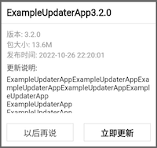

# update_modal

Bugly style update modal on flutter. It is based on UI and cross platform.

**Try the [Demo](https://luo3house.github.io/flutter_update_modal/)**



## Getting Started

Example project is at `example/`.

### Install

Add dependency to `pubspec.yaml`.

```yaml
dependencies:
  update_modal: ^0.0.1
```

### Implement your upgrade checker and downloader

```dart
class UpdateModalServiceImpl implements UpdateModalService {
  @override
  Future<int> cancelDownload() {
    // Perform cancel download, resolve arbitary number
  }

  @override
  Future<UpdateInfo> checkUpdate() async {
    // Perform check update, resolve update info or NULL
    return UpdateInfo()
      ..name = "ExampleUpdaterApp"
      ..version = "3.2.0"
      ..size = "13.6M"
      ..releasedAt = "2022-10-26 22:20:01"
      ..description = "Upgrade description";
  }

  @override
  Future<int> dismiss() {
    // Perform dismiss to cleanup
    return Future.value(0);
  }

  @override
  Future<int> install() {
    // Perform install package
    return Future.value(0);
  }

  @override
  Future<Stream<int>> startDownload() {
    // Perform download, resolve a stream for progress notification
    // When progress > 100(e.g. 101), the modal mark state to readyToInstall
    return Future.value(Stream.fromFutures([
      Future.delayed(Duration(milliseconds: 150 * 1), () => 20),
      Future.delayed(Duration(milliseconds: 150 * 2), () => 40),
      Future.delayed(Duration(milliseconds: 150 * 3), () => 60),
      Future.delayed(Duration(milliseconds: 150 * 4), () => 80),
      Future.delayed(Duration(milliseconds: 150 * 5), () => 100),
      // modal show [Dismiss, Install] once receive progress > 100
      Future.delayed(Duration(milliseconds: 150 * 6), () => 120),
    ]));
  }
}
```

### Perform check at App startup

```dart
class MyApp extends StatefulWidget {
  @override
  createState() => _MyApp();
}

class _MyApp extends State<MyApp> {
  @override
  initState() {
    UpdateModal.init(
      context,
      service: UpdateModalServiceImpl(),
    );
  }

  // build page
}
```

## Debugging

Open a web server for cross-platform modal widget debugging.

```bash
Make example
```

or,

```bash
cd example; flutter run -d web-server --web-port=8080
```

## License

MIT
